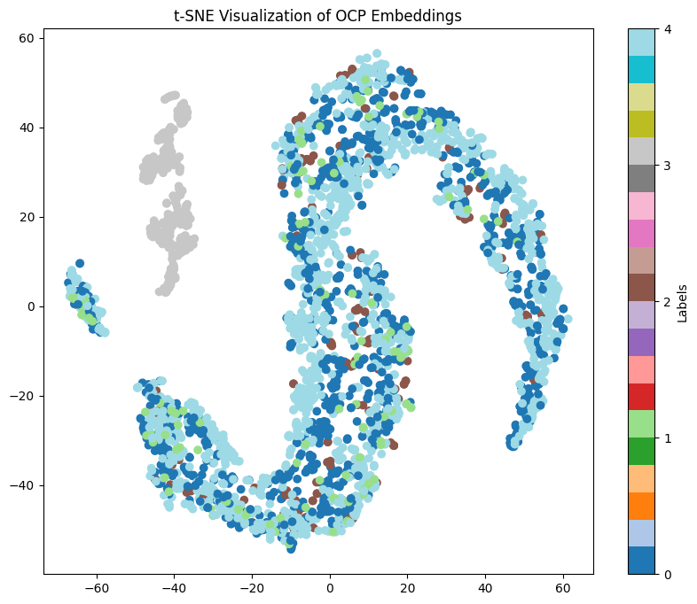

# guiding 3 layer embeddings

dataset
```csv
binary_label,playback_label,media_label,template
not-media,question,not_media,which {author_name} starred in {series_name}
not-media,question,not_media,which {actor_name} invented {silent_movie_name}
not-media,question,not_media,which {actor_name} featured in {series_name}
...
```

## Layer 1

detects if query is media related

### Media vs Not Media


### Playback Types




### Media  Types


## Layer 2

distinguishes GAME, VIDEO, AUDIO, IOT_DEVICE

### Media vs Not Media


### Playback Types


### Media  Types


## Layer 3

distinguishes MOVIE, MUSIC, PODCAST ....

### Media vs Not Media


### Playback Types


### Media  Types


