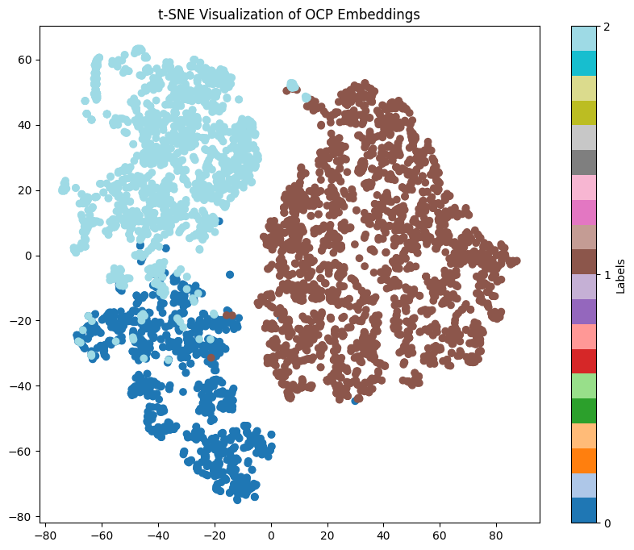

### Labels

- COMMAND: This label refers to statements that give instructions or orders. These can be further divided into sub-labels ACTION and DENIAL.
  - ACTION: This sub-label refers to commands that instruct the listener to perform an action.
  - DENIAL: This sub-label refers to commands that instruct the listener to refrain from performing an action.
- QUESTION: This label refers to statements that ask for information. These can be further divided into sub-labels QUERY, YESNO and REQUEST.
  - QUERY: This sub-label refers to questions that ask for information or definitions.
  - REQUEST: This sub-label refers to questions that make a request.
  - YESNO: This sub-label refers to questions that can be answered with a simple "yes" or "no"
- SENTENCE: This label refers to statements that do not fit into either of the above categories.
  - EXCLAMATION: This sub-label refers to sentences that express strong emotions such as excitement, surprise, or admiration.
  - SOCIAL: This sub-label refers to sentences that are used in social situations to express well-wishes or greetings.
  - STATEMENT: This sub-label refers to sentences that make a statement or convey information.
    
## Embeddings

features have been engineered mainly around postags and a limited word list

```python
from typing import Dict, List
from nltk import word_tokenize, pos_tag


def sentence2dict(sentence: str) -> Dict[str, bool]:
    # Define indicators for different types of sentences
    YES_NO_STARTERS = ['were', 'are', 'will', 'do', 'if', 'have', 'did', 'has', 'does', 'can', 'shall', 'am',
                       'should', 'would', 'was', 'is', 'might', 'must', 'could', 'may', 'would', 'should', 'might']
    QUESTION_STARTERS = ['where', 'when', 'how', 'why', 'who', 'whose', 'which', 'what',
                         'whom', 'how many', 'how much', 'how long', 'how often', 'how far', 'how tall', 'how old',
                         'how big']
    COMMAND_STARTERS = ["don't forget ", "do not forget ", 'please ', 'make sure to ', 'remember to ', 'ensure you ',
                        'do not forget to ', 'don’t forget to ', 'make sure you ']
    DENIAL_STARTERS = ["don't ", "do not ", "no ", 'never ', 'not at all ', 'no way ', 'under no circumstances ']
    THANKS_WORDS = ["thanks", "thank you", 'thanks a lot', 'thanks very much', 'many thanks', 'thanks so much']
    PLEASE_WORDS = ["please", 'kindly', 'would you mind', 'if you could', 'could you please']
    DENIAL_WORDS = ["forbidden", "prohibited", "not permitted", "not allowed", 'unacceptable',
                    'restricted', 'banned', 'out of bounds']
    sentence = sentence.lower().strip()
    tokens = word_tokenize(sentence)
    pos_tags = pos_tag(tokens)

    def contains_conjunction(tokens: List[str]) -> bool:
        """Check if the sentence contains conjunctions."""
        conjunctions = {'and', 'or', 'but', 'so', 'for', 'nor', 'yet'}
        return any(token in conjunctions for token in tokens)

    def lexical_diversity(tokens: List[str]) -> float:
        """Calculate lexical diversity of the tokens."""
        return len(set(tokens)) / len(tokens) if tokens else 0

    def pos_tag_counts(tags: List[str]) -> Dict[str, int]:
        """Count occurrences of specific POS tags."""
        pos_counts = {}
        for tag in tags:
            pos_counts[tag] = pos_counts.get(tag, 0) + 1
        return pos_counts

    def pos_tag_transitions(tags: List[str]) -> Dict[str, int]:
        """Count transitions between POS tags."""
        transitions = {}
        for i in range(len(tags) - 1):
            pair = (tags[i], tags[i + 1])
            transitions[pair] = transitions.get(pair, 0) + 1
        return transitions

    # Initialize feature dictionary
    feats = {}

    # Extract features based on POS tags and sentence content
    if tokens:
        first_word = tokens[0]
        pos_tags_list = [tag for _, tag in pos_tags]

        feats['contains_conjunction'] = contains_conjunction(tokens)
        feats['lexical_diversity'] = lexical_diversity(tokens)
        feats["is_play"] = first_word in {"play", "watch", "listen", "view", "launch", "open", "start", "activate"}
        feats["is_the"] = first_word == "the"
        feats["is_cmd"] = any(sentence.startswith(prefix) for prefix in COMMAND_STARTERS)
        feats["is_denial"] = any(sentence.startswith(prefix) for prefix in DENIAL_STARTERS)
        feats["thanks_words"] = any(word in sentence for word in THANKS_WORDS)
        feats["denial_words"] = any(word in sentence for word in DENIAL_WORDS)
        feats["please_words"] = any(word in sentence for word in PLEASE_WORDS)
        feats["is_yes_no"] = first_word in YES_NO_STARTERS
        feats['is_wh'] = first_word in QUESTION_STARTERS
        feats['startswith_pron'] = first_word in {"he", "she", "it", "they", "their", "we", "i"}

        # Sentence length and token-based features
        feats['sentence_length'] = len(tokens)
        feats['avg_token_length'] = sum(len(token) for token in tokens) / len(tokens) if tokens else 0
        feats['unique_token_count'] = len(set(tokens))

        # POS tag-based features
        pos_counts = pos_tag_counts(pos_tags_list)
        feats.update({
            'num_NN': pos_counts.get('NN', 0),
            'num_NNP': pos_counts.get('NNP', 0),
            'num_NNS': pos_counts.get('NNS', 0),
            'num_NNPS': pos_counts.get('NNPS', 0),
            'num_PRP': pos_counts.get('PRP', 0),
            'num_VB': pos_counts.get('VB', 0),
            'num_VBP': pos_counts.get('VBP', 0),
            'num_VBZ': pos_counts.get('VBZ', 0),
            'num_VBD': pos_counts.get('VBD', 0),
            'num_VBN': pos_counts.get('VBN', 0),
            'num_VBG': pos_counts.get('VBG', 0),
            'num_JJ': pos_counts.get('JJ', 0),
            'num_JJr': pos_counts.get('JJR', 0),
            'num_JJs': pos_counts.get('JJS', 0),
        })

        # POS tag transitions
        transitions = pos_tag_transitions(pos_tags_list)
        for (tag1, tag2), count in transitions.items():
            feats[f'trans_{tag1}_{tag2}'] = count

        # Check for statements
        subject_tags = {"NN", "NNP", "NNS", "NNPS", "PRP"}
        verb_tags = {"VB", "VBP", "VBZ", "VBD", "VBN", "VBG"}
        feats['is_statement'] = any(tag in subject_tags for _, tag in pos_tags[:2]) and \
                                any(tag in verb_tags for _, tag in pos_tags)

        # Check for exclamations and commands
        feats['is_exclamation'] = (first_word == "what" and len(tokens) > 1 and tokens[1] in {"a", "an"}) or \
                                  (first_word == "how" and any(tag == "JJ" for _, tag in pos_tags[:2]))

        feats['is_command'] = any(tag in verb_tags for _, tag in pos_tags[:1]) and \
                              not any(tag in subject_tags for _, tag in pos_tags[:2])

        # Check for polite requests
        feats['is_request'] = first_word in {"would", "could", "can"} and any(tag == "PRP" for _, tag in pos_tags[1:2])

        # Social expressions
        social_expressions_starters = {"have", "get", "help"}
        feats['is_social_expression'] = first_word in social_expressions_starters and \
                                        any(tag == "VB" for _, tag in pos_tags[:1])

    return feats
```

### Layer 1 - COMMAND/QUESTION/SENTENCE




### Layer 2 - ACTION/DENIAL/QUERY/REQUEST/YESNO/EXCLAMATION/SOCIAL/STATEMENT


