### Labels

- COMMAND: This label refers to statements that give instructions or orders. These can be further divided into sub-labels ACTION and DENIAL.
  - ACTION: This sub-label refers to commands that instruct the listener to perform an action.
  - DENIAL: This sub-label refers to commands that instruct the listener to refrain from performing an action.
- QUESTION: This label refers to statements that ask for information. These can be further divided into sub-labels QUERY, YESNO and REQUEST.
  - QUERY: This sub-label refers to questions that ask for information or definitions.
  - REQUEST: This sub-label refers to questions that make a request.
  - YESNO: This sub-label refers to questions that can be answered with a simple "yes" or "no"
- SENTENCE: This label refers to statements that do not fit into either of the above categories.
  - EXCLAMATION: This sub-label refers to sentences that express strong emotions such as excitement, surprise, or admiration.
  - SOCIAL: This sub-label refers to sentences that are used in social situations to express well-wishes or greetings.
  - STATEMENT: This sub-label refers to sentences that make a statement or convey information.
    

### Embeddings

```python
MODELS = {
    "all-MiniLM-L6-v2": "https://huggingface.co/leliuga/all-MiniLM-L6-v2-GGUF/resolve/main/all-MiniLM-L6-v2.Q4_K_M.gguf",
    "all-MiniLM-L12-v2": "https://huggingface.co/leliuga/all-MiniLM-L12-v2-GGUF/resolve/main/all-MiniLM-L12-v2.Q4_K_M.gguf",
    "multi-qa-MiniLM-L6-cos-v1": "https://huggingface.co/Felladrin/gguf-multi-qa-MiniLM-L6-cos-v1/resolve/main/multi-qa-MiniLM-L6-cos-v1.Q4_K_M.gguf",
    "gist-all-minilm-l6-v2": "https://huggingface.co/afrideva/GIST-all-MiniLM-L6-v2-GGUF/resolve/main/gist-all-minilm-l6-v2.Q4_K_M.gguf",
    "paraphrase-multilingual-minilm-l12-v2": "https://huggingface.co/krogoldAI/paraphrase-multilingual-MiniLM-L12-v2-Q4_K_M-GGUF/resolve/main/paraphrase-multilingual-minilm-l12-v2.Q4_K_M.gguf"
}
```

## Multilingual

> paraphrase-multilingual-minilm-l12-v2

### Layer 1

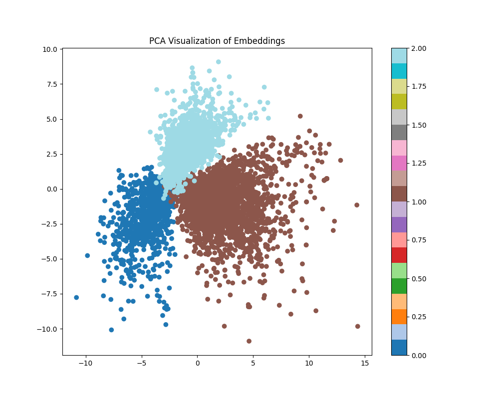
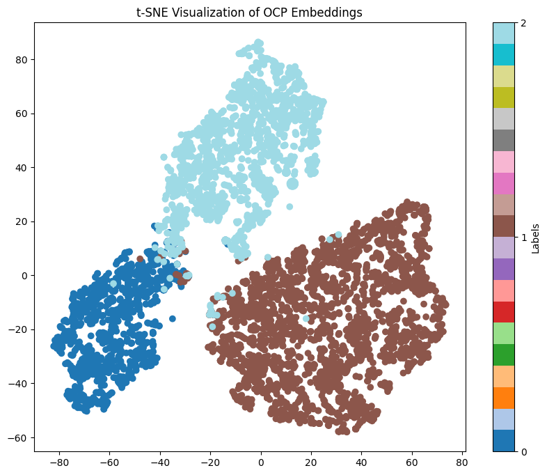

### Layer 2

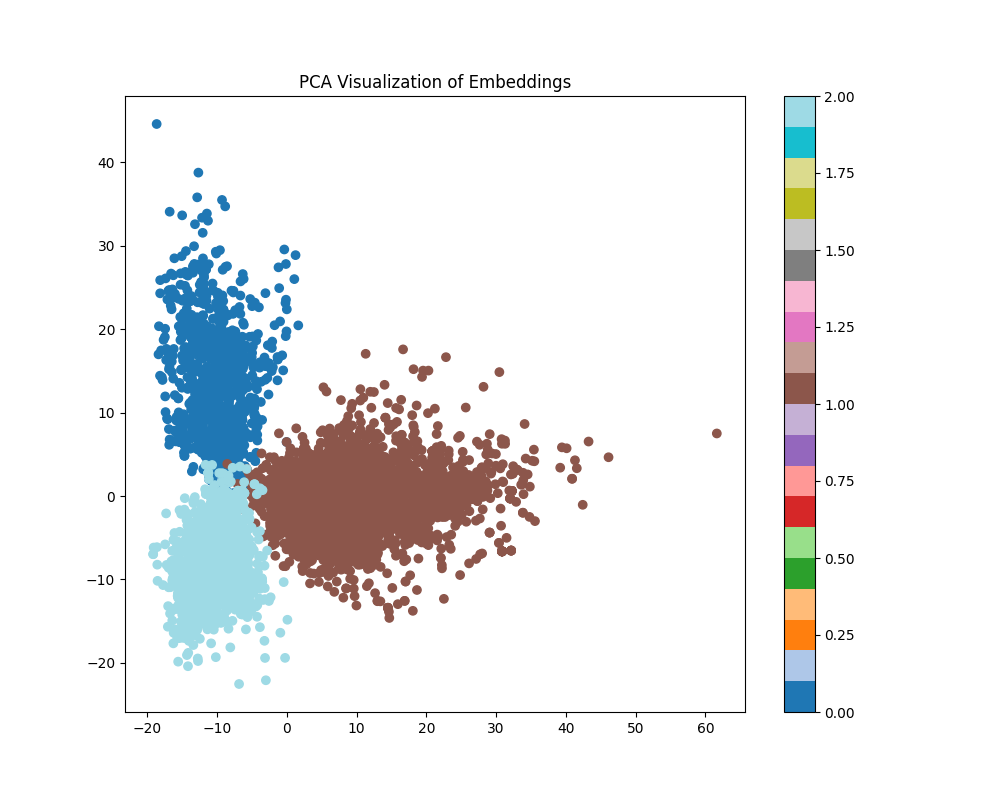
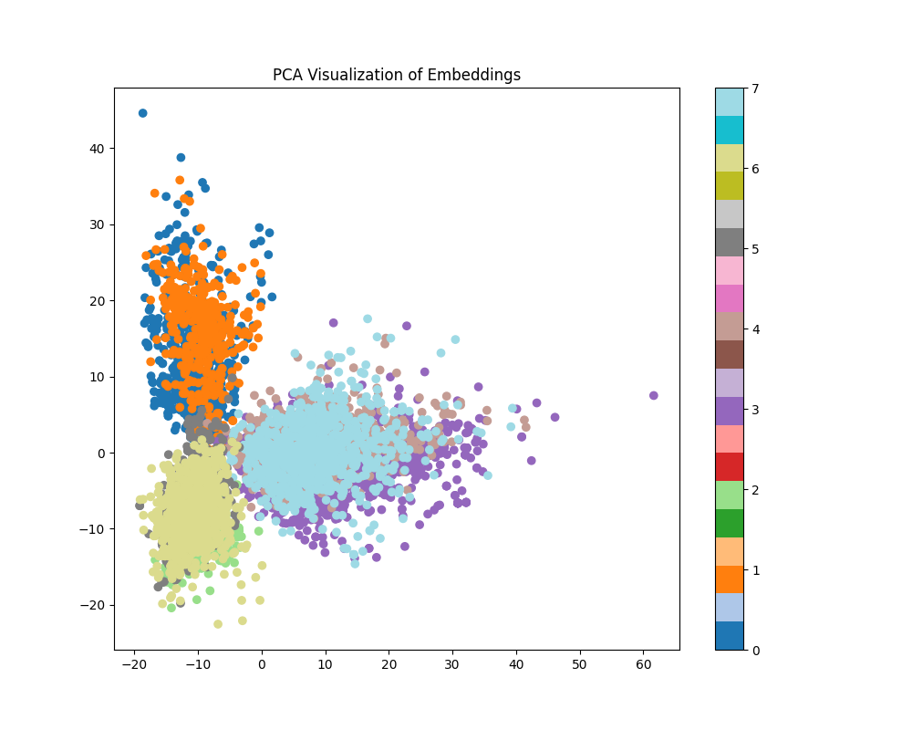
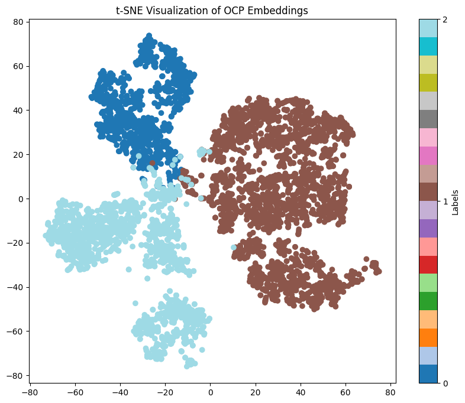
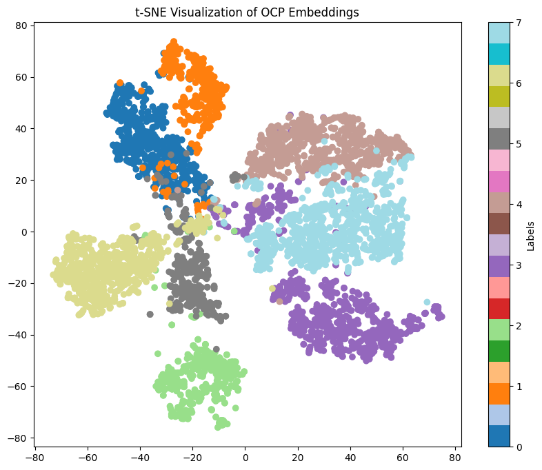


## English

> gist-all-minilm-l6-v2

### Layer 1

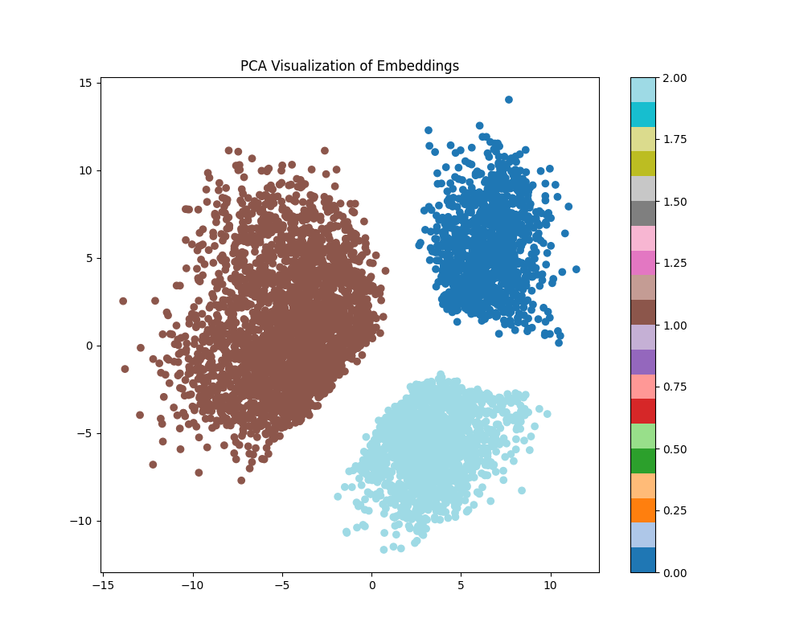
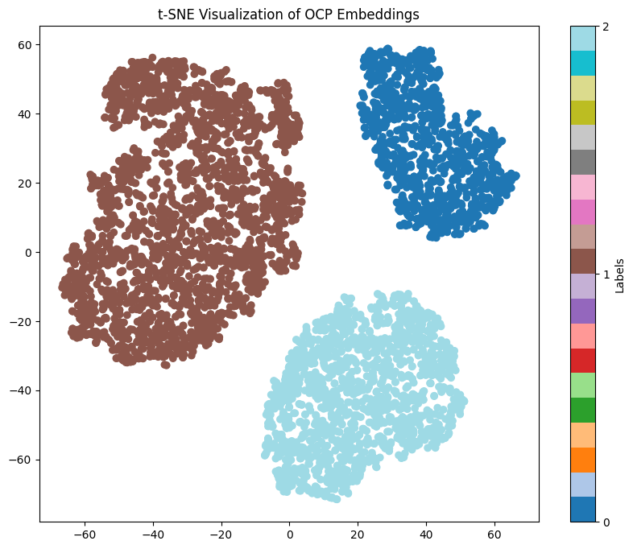

### Layer 2

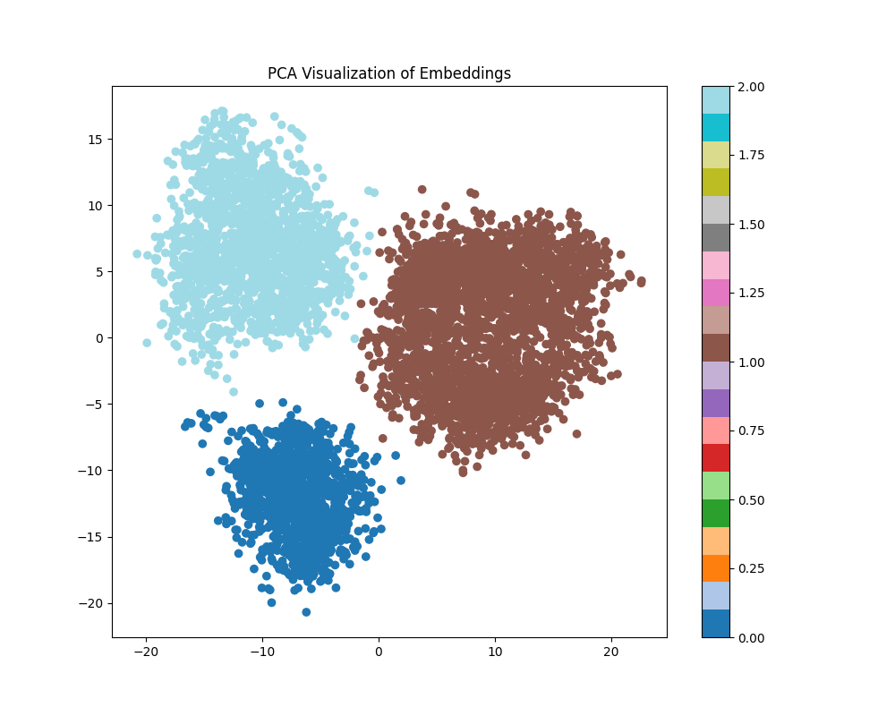
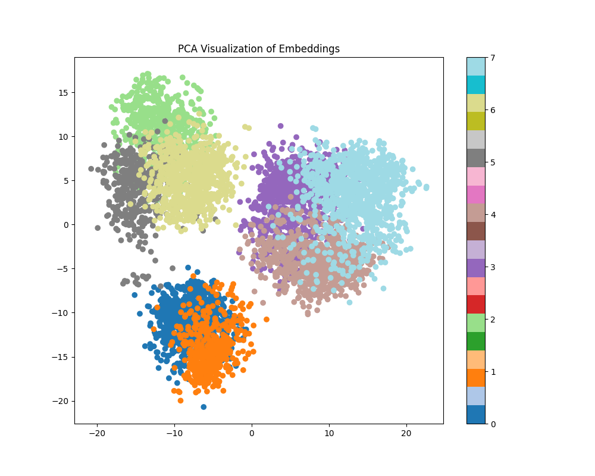
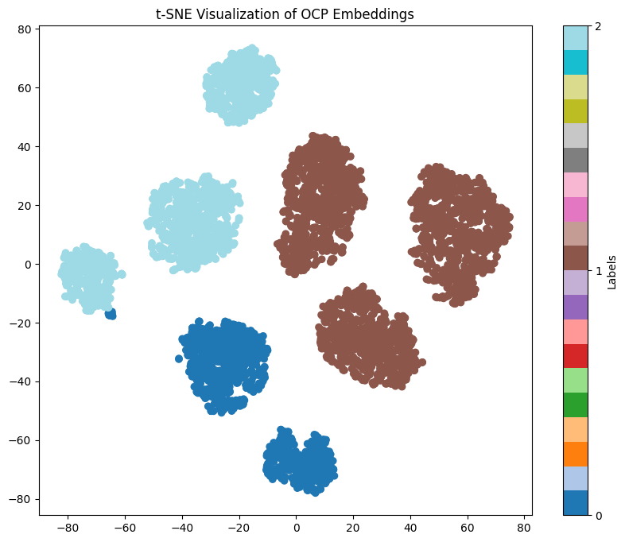
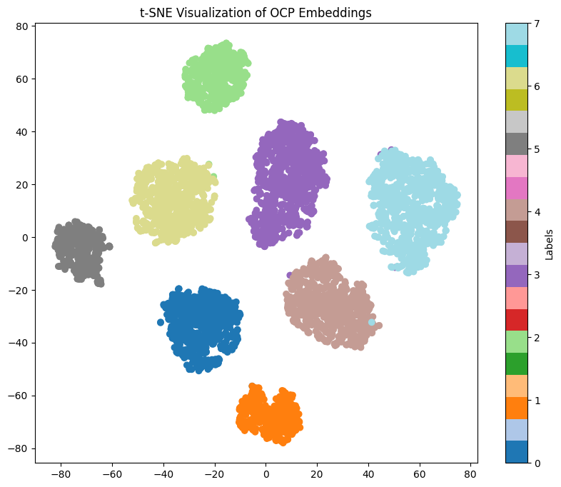

