# Multilingual embeddings  

continuation of [questions_experiment_2](https://github.com/TigreGotico/guided-categorical-embeddings/tree/dev/examples/questions_experiment_2) but with multilingual support

dataset machine translated from english to portuguese, trained wih en + pt data

## Usage

```python
from guided_categorical_embeddings.guided import MultiLabelGuidedEmbeddingsTransformer
from ovos_gguf_embeddings import GGUFTextEmbeddingsStore

EMB_MODEL = "paraphrase-multilingual-minilm-l12-v2"
model = GGUFTextEmbeddingsStore(model=EMB_MODEL,
                                skip_db=True,
                                n_gpu_layers=-1)

transformer = MultiLabelGuidedEmbeddingsTransformer.load(f"{EMB_MODEL}_questions_embedding_transformer.pkl")
print(transformer.predict([
    model.get_text_embeddings("qual é a coisa"),
    model.get_text_embeddings("what is the joke"),
    model.get_text_embeddings("conta uma piada"),
    model.get_text_embeddings("conta-me uma anedota por favor"),
    model.get_text_embeddings("podes contar uma piada"),
    model.get_text_embeddings("posso contar uma anedota")
]))
# ['QUERY' 'QUERY' 'ACTION' 'ACTION' 'YESNO' 'YESNO']
```


## Small

> paraphrase-multilingual-minilm-l12-v2

#### Layer 1

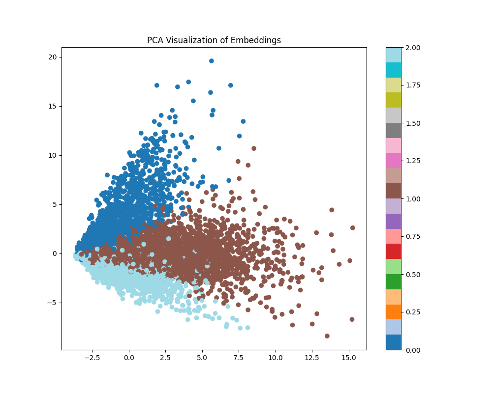
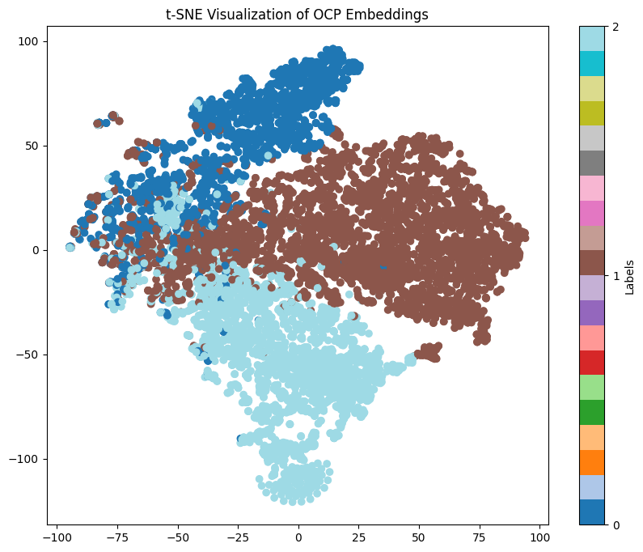

#### Layer 2

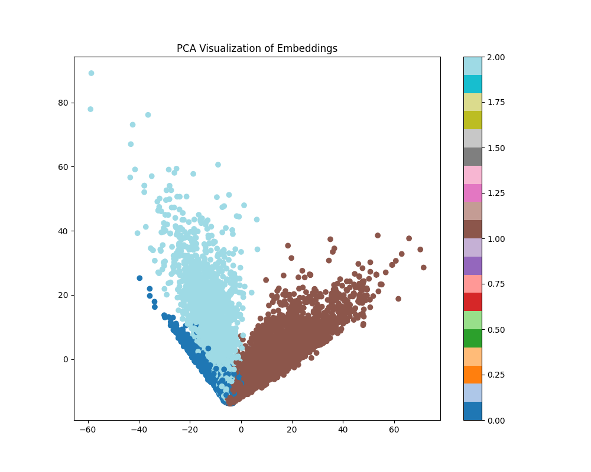
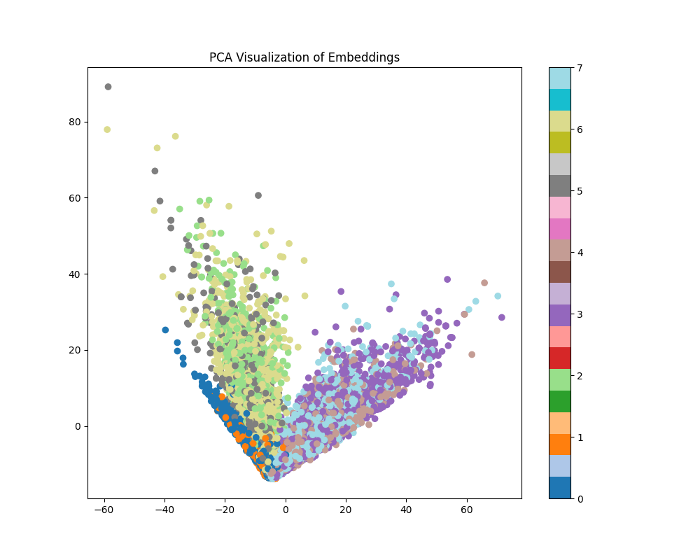
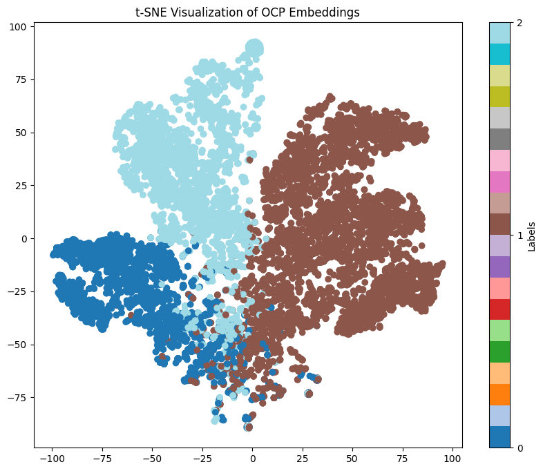
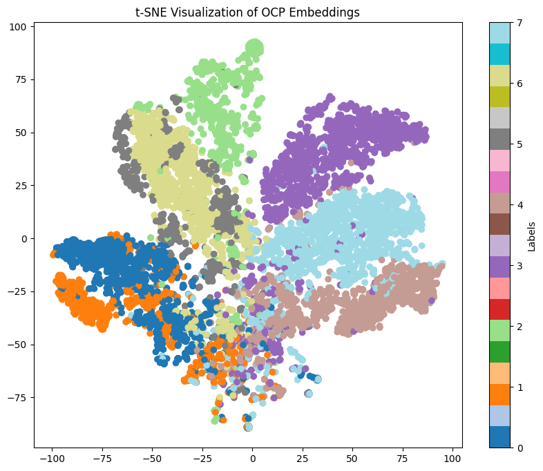

## Large

> labse

#### Layer 1

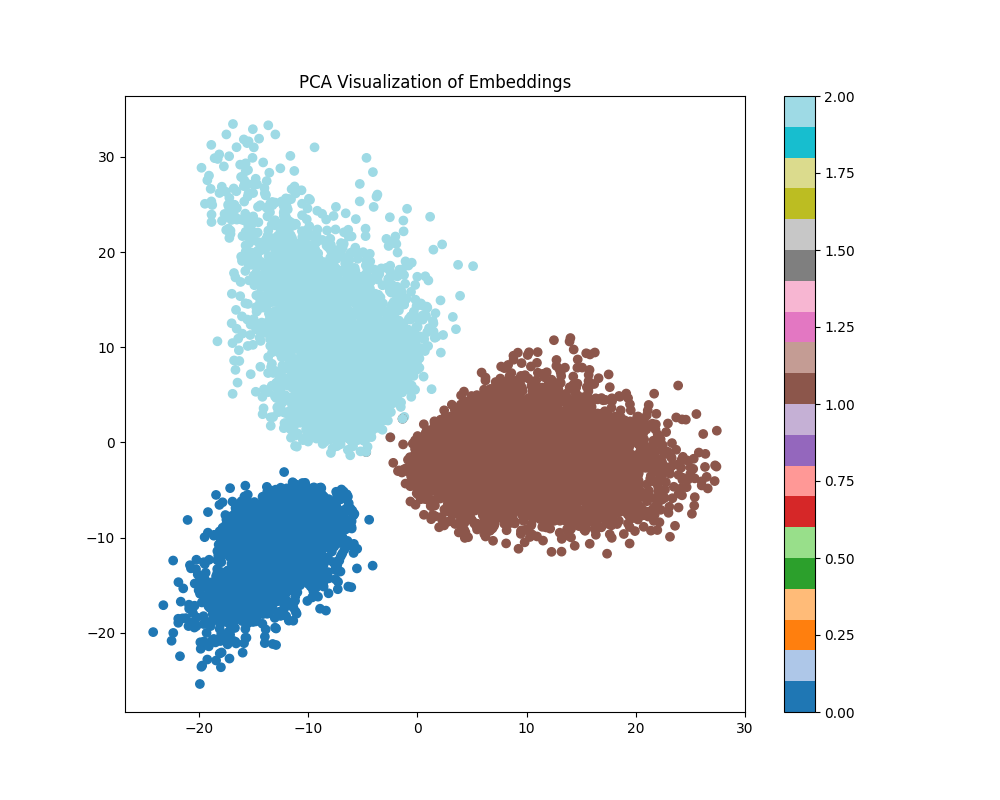
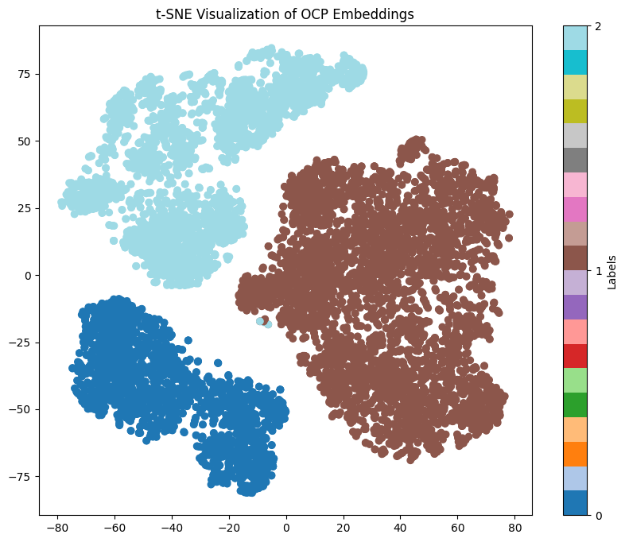

#### Layer 2

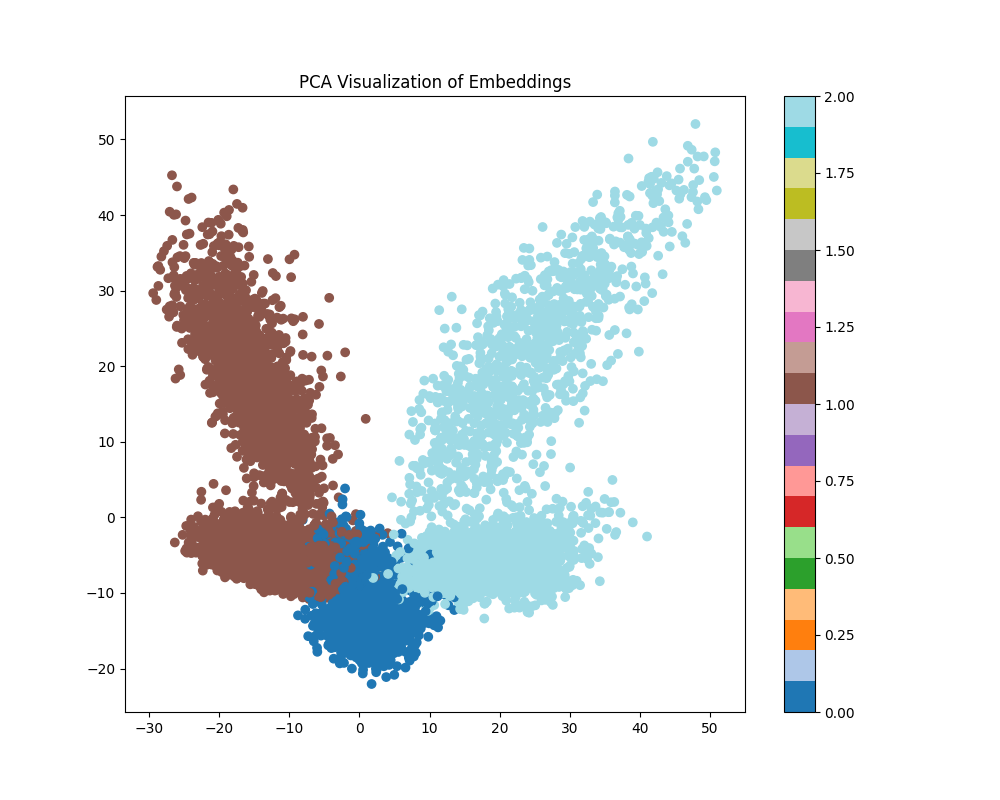
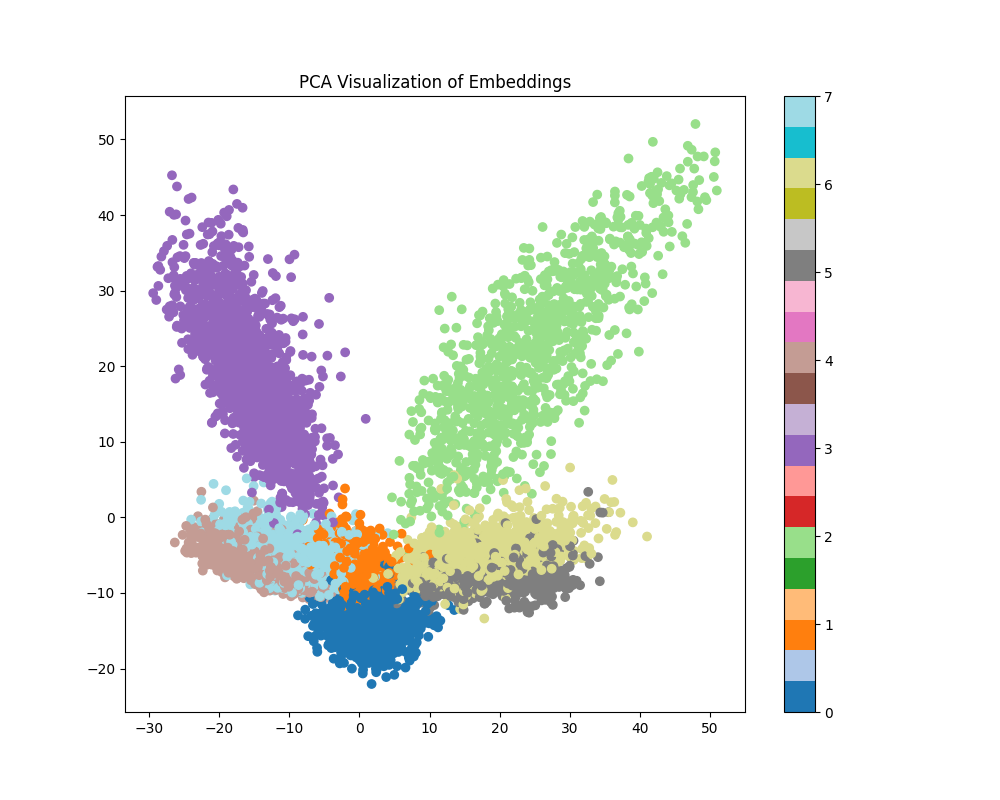
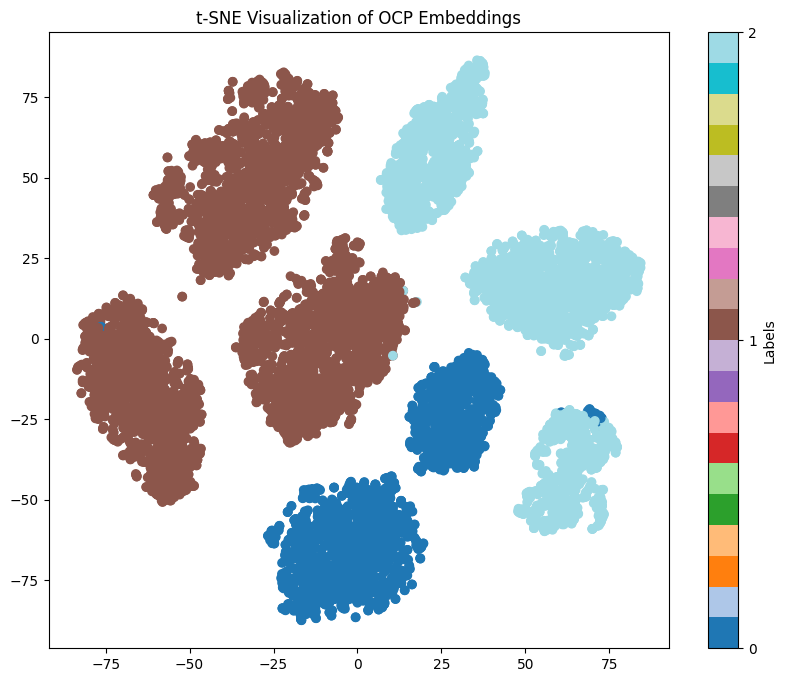
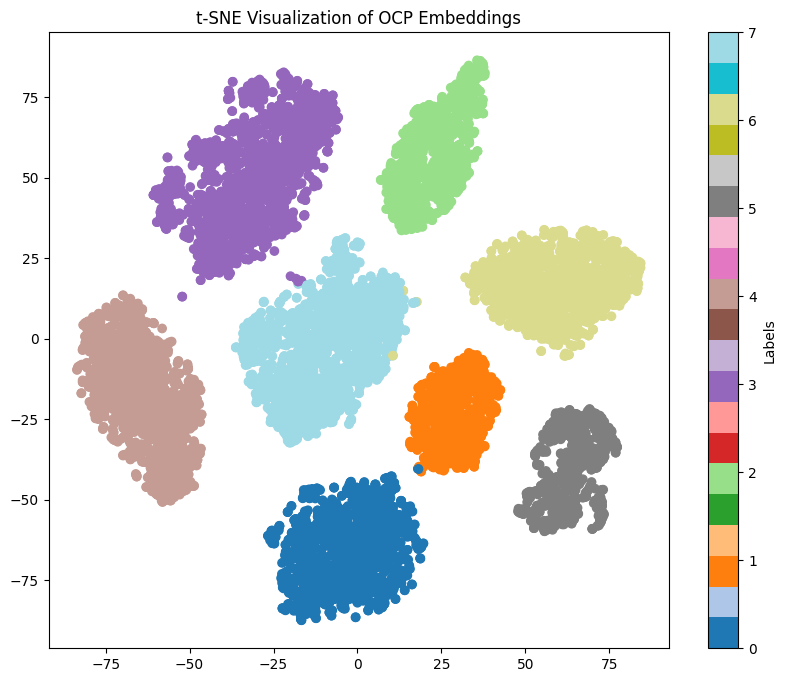
